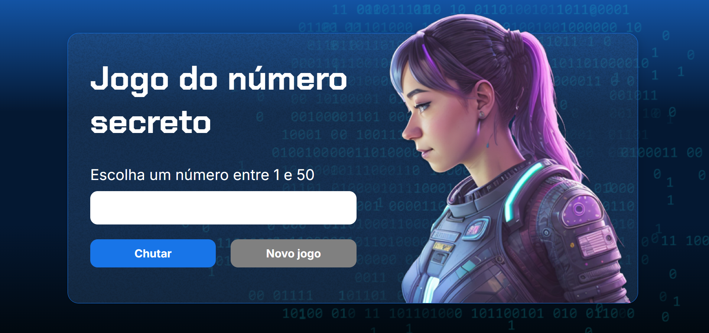

<h1>Jogo do número secreto</h1>

[Link](https://jogo-nine-sand.vercel.app/)

<h2>Sobre</h2>

Projeto utilizado nos cursos de lógica de programação da Alura.

Feito em HTML, CSS e JavaScript. Consiste em tentar adivinhar um número aleatorio no menor número de tentativas

## 🚀 Tecnologias

  
  
  

